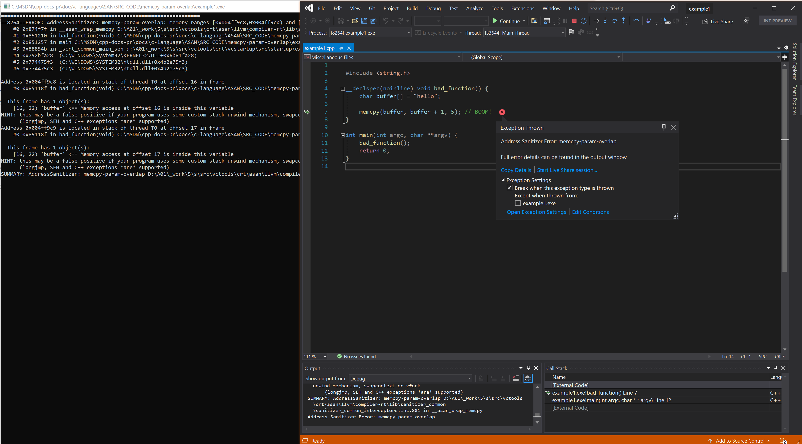

# Example: `memcpy-param-overlap` error

The CRT function [`memcpy`](../c-runtime-library/reference/memcpy-wmemcpy.md) **doesn't support** overlapping memory. The CRT provides an alternative to `memcpy` that does support overlapping memory: [`memmove`](../c-runtime-library/reference/memmove-wmemmove.md).

A common error is to treat `memmove` as being semantically equivalent to `memcpy`.

Example sourced from [LLVM compiler-rt test suite](https://github.com/llvm/llvm-project/tree/main/compiler-rt/test/asan/TestCases).

## Example

```cpp
// example1.cpp
// memcpy-param-overlap error
#include <string.h>

__declspec(noinline) void bad_function() {
    char buffer[] = "hello";

    memcpy(buffer, buffer + 1, 5); // BOOM!
}

int main(int argc, char **argv) {
    bad_function();
    return 0;
}
```

To build and test this example, run these commands in a Visual Studio 2019 version 16.9 or later [developer command prompt](../build/building-on-the-command-line.md#developer_command_prompt_shortcuts):

```cmd
cl example1.cpp /fsanitize=address /Zi
devenv /debugexe example1.exe
```

### Resulting error



## See also

[AddressSanitizer overview](./asan.md)\
[AddressSanitizer known issues](./asan-known-issues.md)\
[AddressSanitizer build and language reference](./asan-building.md)\
[AddressSanitizer runtime reference](./asan-runtime.md)\
[AddressSanitizer shadow bytes](./asan-shadowbytes.md)\
[AddressSanitizer cloud or distributed testing](./asan-offline-crash-dumps.md)\
[AddressSanitizer debugger integration](./asan-debugger-integration.md)\
[AddressSanitizer error examples](./asan-examples.md)
