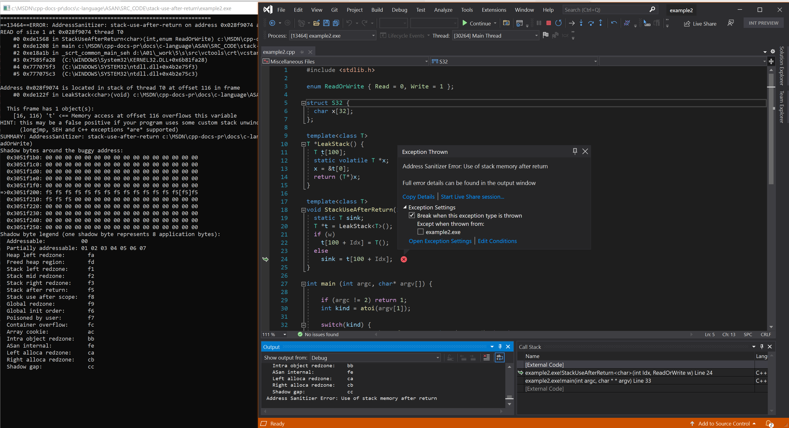

# Stack Use After Return

This functionality requires code generation that is activated under an extra compiler flag `/fsanitize-address-use-after-return`, and by setting the environment variable `ASAN_OPTIONS=detect_stack_use_after_return=1`.

Consider the [Clang summary](https://github.com/google/sanitizers/wiki/AddressSanitizerUseAfterReturn) of the algorithm supporting use after return, and the larger performance costs.

**Warning**: If you create an object file using the extra flag /fsanitize-address-use-after-return the code, generated by the compiler, will make a runtime decision on how to allocate a stack frame.  If the environment variable ASAN_OPTIONS is **not** set to detect_stack_use_after_return, the code is still slower than **only** using /fsanitize=address. There's additional overhead from some stack frames allocating a frame using alloca() instead of putting the frame in the heap. It's best to delete these object files when you are finished processing use-after-return errors.

Examples sourced from [LLVM compiler-rt test suite](https://github.com/llvm/llvm-project/tree/main/compiler-rt/test/asan/TestCases).

## Example - Simple 'C'

```cpp

char *x;

void foo() {
  char stack_buffer[42];
  x = &stack_buffer[13];
}

int main() {

  foo();
  *x = 42; // Boom!

  return 0;
}

```

From a **Developer Command Prompt**:
```
 cl example1.cpp /fsanitize=address /fsanitize-address-use-after-return /Zi
 set ASAN_OPTIONS=detect_stack_use_after_return=1
 devenv /debugexe example1.exe
```

## Resulting error - Simple 'C'


## Example - C++ and templates

```cpp
#include <stdlib.h>

enum ReadOrWrite { Read = 0, Write = 1 };

struct S32 {
  char x[32];
};

template<class T>
T *LeakStack() {
  T t[100];
  static volatile T *x;
  x = &t[0];
  return (T*)x;
}

template<class T>
void StackUseAfterReturn(int Idx, ReadOrWrite w) {
  static T sink;
  T *t = LeakStack<T>();
  if (w)
    t[100 + Idx] = T();
  else
    sink = t[100 + Idx];
}

int main (int argc, char* argv[]) {

    if (argc != 2) return 1;
    int kind = atoi(argv[1]);

    switch(kind) {
        case 1: StackUseAfterReturn<char>(0, Read); break;
        case 2: StackUseAfterReturn<S32>(0, Write); break;
    }
    return 0;
}
```

From a **Developer Command Prompt**:
```
 cl example2.cpp /fsanitize=address /fsanitize-address-use-after-return /Zi
 set ASAN_OPTIONS=detect_stack_use_after_return=1
 devenv /debugexe example2.exe 1
```

## Resulting error - C++ and templates


