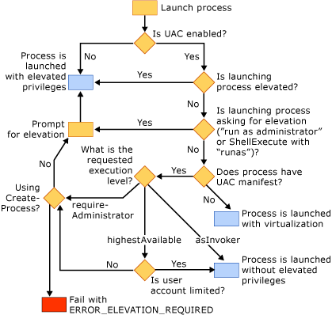

# How User Account Control (UAC) Affects Your Application

User Account Control (UAC) is a feature of Windows Vista in which user accounts have limited privileges. You can find detailed information about UAC at these sites:

- [Developer Best Practices and Guidelines for Applications in a Least Privileged Environment](/windows/win32/uxguide/winenv-uac)

## Building Projects after Enabling UAC

If you build a Visual Studio C++ project on Windows Vista with UAC disabled, and you later enable UAC, you must clean and rebuild the project for it to work correctly.

## Applications that Require Administrative Privileges

By default, the Visual C++ linker embeds a UAC fragment into the manifest of an application with an execution level of `asInvoker`. If your application requires administrative privileges to run correctly (for example, if it modifies the HKLM node of the registry or if it writes to protected areas of the disk, such as the Windows directory), you must modify your application.

The first option is to modify the UAC fragment of the manifest to change the execution level to *requireAdministrator*. The application will then prompt the user for administrative credentials before it runs. For information about how to do this, see [/MANIFESTUAC (Embeds UAC information in manifest)](../build/reference/manifestuac-embeds-uac-information-in-manifest.md).

The second option is to not embed a UAC fragment into the manifest by specifying the `/MANIFESTUAC:NO` linker option. In this case, your application will run virtualized. Any changes you make to the registry or to the file system will not persist after your application has ended.

The following flowchart describes how your application will run depending on whether UAC is enabled and whether the application has a UAC manifest:

## See also

[Security Best Practices](security-best-practices-for-cpp.md)
