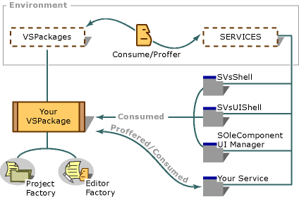

# Visual Studio Extensibility Architecture
The [!INCLUDE[vsprvs](../includes/vsprvs-md.md)] integrated development environment (IDE) is a framework for hosting VSPackages and for making it easier to exchange shared services. An example of this is the way the IDE implements the user interface (UI). The IDE provides the container window and the default toolbars and menus. It also provides a rich COM infrastructure that makes the UI programmable. The complete command handling and routing scheme gives users an open framework that offers easy access to both existing and installed command sets.  
  
## Extensibility Architecture  
 The following illustration shows the [!INCLUDE[vsprvs](../includes/vsprvs-md.md)] extensibility architecture. Note that the concept of software application is absent. Instead, the IDE hosts software components, called VSPackages, that provide application functionality. This functionality, in turn, is shared across the IDE as services. VSPackages offer services that they and other VSPackages use. The standard IDE also offers a broad range of services, such as <xref:Microsoft.VisualStudio.Shell.Interop.SVsUIShell>, which provide access to the IDE windowing functionality.  
  
   
Generalized view of the Visual Studio architecture  
  
 Notice that the relationship between VSPackages and services is bidirectional. Although VSPackages use services offered by others, they also can offer services of their own by using the <xref:Microsoft.VisualStudio.Shell.Interop.IProfferService> interface. This service-based architecture grew out of the Microsoft ActiveX Designer implementation, in which a service is a group of related interfaces that perform a task. From a strict COM viewpoint, all the interfaces of a particular service must be implemented in a single COM class.  
  
 The standard IDE offers important services, such as <xref:Microsoft.VisualStudio.Shell.Interop.SVsShell>, <xref:Microsoft.VisualStudio.Shell.Interop.SVsUIShell>, and <xref:Microsoft.VisualStudio.Shell.Interop.SVsSolution>, which are used by VSPackages. The following table lists and describes some of these services. For more information, see [Using and Providing Services](http://msdn.microsoft.com/library/c0b415ba-b825-4da0-9faf-8a60a663e302).  
  
|IDE service|Description|  
|-----------------|-----------------|  
|<xref:Microsoft.VisualStudio.Shell.Interop.SVsShell>|Provides access to IDE services dealing with basic functionality, VSPackages, and the registry.|  
|<xref:Microsoft.VisualStudio.Shell.Interop.SVsUIShell>|Provides basic windowing and UI-related functionality in the IDE, such as the ability to create tools and document windows.|  
|<xref:Microsoft.VisualStudio.Shell.Interop.SVsSolution>|Provides basic solution-related functionality, such as the ability to enumerate projects, create new projects, and monitor project changes.|  
  
 Because of their tight integration through the interaction of shared services, the [!INCLUDE[vsprvs](../includes/vsprvs-md.md)] IDE and VSPackages are closely interdependent. However, despite their close interaction they have different responsibilities.  
  
 The [!INCLUDE[vsprvs](../includes/vsprvs-md.md)] IDE is responsible for the following tasks:  
  
-   Providing critical services for use by external VSPackages.  
  
-   Providing a programmable interface, which enables participation with standard UI elements.  
  
-   Creating instances of VSPackages as required by user actions or by other VSPackages requesting services.  
  
-   Providing services that make it possible for communication and coordination between VSPackages.  
  
-   Managing solutions and their required files.  
  
-   Providing window management.  
  
-   Providing command routing and command bars, such as menus, toolbars, and context menus.  
  
-   Coordinating selection, context, and currency.  
  
 VSPackages are responsible for the following tasks:  
  
-   Performing certain initialization and termination routines.  
  
-   Writing information to the registry, which the IDE uses to load the appropriate VSPackages at the appropriate times.  
  
-   Offering the services that are required for communicating with other VSPackages.  
  
-   Providing implementations for new project types, editors, and designers.  
  
-   Providing extensions for built-in UI elements, such as task items, toolbox items, and the Options dialog box.  
  
## See Also  
 [Visual Studio Shell](http://msdn.microsoft.com/library/cb124ef4-1a6b-4bfe-bfbf-295ef9c07f36)   
 [VSPackages](http://msdn.microsoft.com/library/cad0893a-9c5f-45b7-952a-e2294f83e324)   
 [Using and Providing Services](http://msdn.microsoft.com/library/c0b415ba-b825-4da0-9faf-8a60a663e302)   
 [How to: Get a Service](http://msdn.microsoft.com/library/1f000020-8fb7-4e39-8e1e-2e38c7fec3d4)