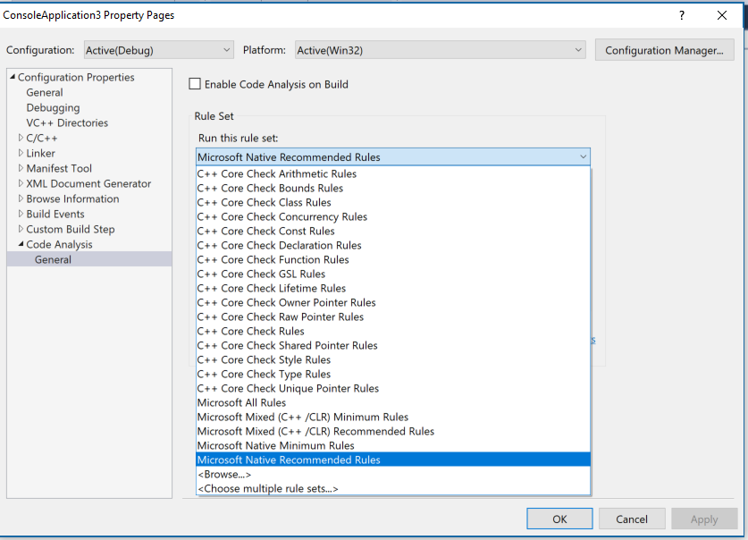

# What's New for Visual C++ in [!INCLUDE[vs_dev15_md](misc/includes/vs_dev15_md.md)]

[!INCLUDE[vs_dev15_md](misc/includes/vs_dev15_md.md)] brings many updates and fixes to the Visual C++ environment. We've fixed over 250 bugs and reported issues in the compiler and tools, many submitted by customers through [Microsoft Connect](https://connect.microsoft.com/VisualStudio "Microsoft Connect"). Thank you for reporting bugs!  For more information on what's new in all of Visual Studio, please visit [What's new in [!INCLUDE[vs_dev15_md](misc/includes/vs_dev15_md.md)]](https://go.microsoft.com/fwlink/?linkid=834481).

<!--The compiler and tools version number in [!INCLUDE[vs_dev15_md](misc/includes/vs_dev15_md.md)] is 14.10.24629. -->

## C++ Compiler

### C++ conformance improvements
In this release, we've updated the C++ compiler and standard library with enhanced support for C++11 and C++14 features, as well as preliminary support for certain features expected to be in the C++17 standard. For detailed information, see [C++ Conformance Improvements in Visual Studio 2017](cpp-conformance-improvements-2017.md).

### New compiler switches  

 -**/std:c++14** and **/std:c++latest**: These compiler switches enable you to opt-in to specific versions of the ISO C++ programming language in a project. For more information, see [-std (Specify Language Standard Version)](build/reference/std-specify-language-standard-version.md). Most of the new draft standard features are guarded by the /std:c++latest switch. 

**Visual Studio 2017 version 15.3**: The **/std:c++17** option enables the set of C++17 features implemented by the Visual C++ compiler. This option disables compiler and standard library support for features that are changed or new in more recent versions of the Working Draft and defect updates of the C++ Standard.

-[/permissive-](build/reference/permissive-standards-conformance.md): Enable all strict standards conformance compiler options and disable most Microsoft-specific compiler extensions (but not __declspec(dllimport), for example). (Off by default but will be on by default at some point in the future.)

-[/diagnostics](build/reference/diagnostics-compiler-diagnostic-options.md): 
Enable display of the line number, the line number and column, or the line number and column and a caret under the line of code where the diagnostic error or warning was found.

-[/debug:fastlink](build/reference/debug-generate-debug-info.md):  
Enable up to 30% faster incremental link times (vs. Visual Studio 2015) by not copying all debug information into the PDB file. The PDB file instead points to the debug information for the object and library files used to create the executable. See [Faster C++ build cycle in VS “15” with /Debug:fastlink](https://blogs.msdn.microsoft.com/vcblog/2016/10/05/faster-c-build-cycle-in-vs-15-with-debugfastlink/) and [Recommendations to speed C++ builds in Visual Studio](https://blogs.msdn.microsoft.com/vcblog/2016/10/26/recommendations-to-speed-c-builds-in-visual-studio/).

[!INCLUDE[vs_dev15_md](misc/includes/vs_dev15_md.md)] allows using /sdl with /await. We removed the /RTC limitation with Coroutines. 

### Codegen, security, diagnostics and versioning
This release brings several improvements in optimization, code generation, toolset versioning, and diagnostics. Some notable improvements include:  

- Improved code generation of loops: Support for automatic vectorization of division of constant integers, better identification of memset patterns.
- Improved code security: Improved emission of buffer overrun compiler diagnostics, and /guard:cf now guards switch statements that generate jump tables.
- Versioning: The value of the built-in preprocessor macro _MSC_VER is now being monotonically updated at every Visual C++ toolset update. For more information, see [Visual C++ Compiler Version](https://blogs.msdn.microsoft.com/vcblog/2016/10/05/visual-c-compiler-version/).
- New toolset layout: The compiler and related build tools have a new location and directory structure on your development machine. The new layout enables side-by-side installations of multiple versions of the compiler. For more information, see [Compiler Tools Layout in Visual Studio "15"](https://blogs.msdn.microsoft.com/vcblog/2016/10/07/compiler-tools-layout-in-visual-studio-15/).
- Improved diagnostics: The output window now shows the column where an error occurs. For more information, see [C++ compiler diagnostics improvements in VS "15" Preview 5](https://blogs.msdn.microsoft.com/vcblog/2016/10/05/c-compiler-diagnostics-improvements-in-vs-15-rc/).
- When using co-routines, the experimental keyword "yield" (available under the /await switch) has been removed. Your code should be updated to use `co_yield` instead. For more information, see the [Visual C++ Team blog](https://blogs.msdn.microsoft.com/vcblog/). 

**Visual Studio 2017 version 15.3**: Additional improvements to diagnostics in the compiler. For more information, see [Diagnostic Improvements in Visual Studio 2017 15.3.0](https://blogs.msdn.microsoft.com/vcblog/2017/07/21/diagnostic-improvements-in-vs2017-15-3-0/).

## C++ Libraries

### Standard Library improvements:

* Minor basic_string _ITERATOR_DEBUG_LEVEL != 0 diagnostics improvements. Tripping an IDL check in string machinery will now report the specific behavior that caused the trip. For example, instead of "string iterator not dereferencable" you'll get "cannot dereference string iterator because it is out of range (e.g. an end iterator)".
* Performance improvement: made basic_string::find(char) overloads only call traits::find once. Previously this was implemented as a general string search for a string of length 1.
* Performance improvement: basic_string::operator== now checks the string's size before comparing the strings' contents.
* Performance improvement: removed control coupling in basic_string which was difficult for the compiler optimizer to analyze. Resolves VSO# 262848 "<string>: reserve() does too much work". Note that for all short strings, calling reserve still has nonzero cost to do nothing.
* We added \<any\>, \<string_view\>, apply(), make_from_tuple().
* std::vector has been overhauled for correctness and performance: aliasing during insertion/emplacement is now correctly handled as required by the Standard, the strong exception guarantee is now provided when required by the Standard via move_if_noexcept() and other logic, and insertion/emplacement perform fewer element operations.
* The C++ Standard Library now avoids dereferencing null fancy pointers.
* Added \<optional\>, \<variant\>, shared_ptr::weak_type, and \<cstdalign\>.
* Enabled C++14 constexpr in min/max/minmax(initializer_list) and min_element/max_element/minmax_element().
* Improved weak_ptr::lock() performance.
* Fixed std::promise's move assignment operator, which previously could cause code to block forever.
* Fixed compiler errors with atomic\<T \*\>'s implicit conversion to T \*.
* pointer_traits\<Ptr\> now correctly detects Ptr::rebind\<U\>.
* Fixed a missing const qualifier in move_iterator's subtraction operator.
* Fixed silent bad codegen for stateful user-defined allocators requesting propagate_on_container_copy_assignment and propagate_on_container_move_assignment.
* atomic\<T\> now tolerates overloaded operator&().
* To increase compiler throughput, C++ Standard Library headers now avoid including declarations for unnecessary compiler intrinsics.
* Slightly improved compiler diagnostics for incorrect bind() calls.
* Improved the performance of std::string/std::wstring's move constructors by more than 3x
* For a complete list of Standard Library improvments see the [Standard Library Fixes In VS 2017 RTM](https://blogs.msdn.microsoft.com/vcblog/2017/02/06/stl-fixes-in-vs-2017-rtm/).

#### Visual Studio 2017 version 15.3

##### C++17 features 
Several additional C++17 features have been implemented. For more information, see [Visual C++ Language Conformance](visual-cpp-language-conformance.md).

##### Other new features
* The Standard Library no longer depends on Magic Statics, allowing clean use in code compiled with /Zc:threadSafeInit-.
* Implemented P0602R0 "variant and optional should propagate copy/move triviality".
* The Standard Library now officially tolerates dynamic RTTI being disabled via /GR-. dynamic_pointer_cast() and rethrow_if_nested() inherently require dynamic_cast, so the Standard Library now marks them as =delete under /GR-.
* Even when dynamic RTTI has been disabled via /GR-, "static RTTI" (in the form of typeid(SomeType)) is still available and powers several Standard Library components. The Standard Library now supports disabling this too, via /D_HAS_STATIC_RTTI=0. *Note that this will disable std::any, std::function's target() and target_type(), and shared_ptr's get_deleter().*

##### Correctness Fixes
* Standard Library containers now clamp their max_size() to numeric_limits<difference_type>::max() rather than size_type's max. This ensures that the result of distance() on iterators from that container is representable in the return type of distance().
* Fixed missing specialization auto_ptr<void>.
* The meow_n() algorithms previously failed to compile if the length argument was not an integral type; they now attempt to convert non-integral lengths to the iterators' difference_type.
* normal_distribution<float> no longer emits warnings inside the Standard Library about narrowing from double to float.
* Fixed some basic_string operations which were comparing with npos instead of max_size() when checking for maximum size overflow.
* condition_variable::wait_for(lock, relative_time, predicate) would wait for the entire relative time in the event of a spurious wake. Now, it will wait for only a single interval of the relative time.
* future::get() now invalidates the future, as the standard requires.
* iterator_traits<void *> used to be a hard error because it attempted to form void&; it now cleanly becomes an empty struct to allow use of iterator_traits in "is iterator" SFINAE conditions.
* Some warnings reported by Clang -Wsystem-headers were fixed.
* Also fixed "exception specification in declaration does not match previous declaration" reported by Clang -Wmicrosoft-exception-spec.
* Also fixed mem-initializer-list ordering warnings reported by Clang and C1XX.
* The unordered containers did not swap their hashers or predicates when the containers themselves were swapped. Now they do.
* Many container swap operations are now marked noexcept (as our Standard Library never intends to throw an exception when detecting the non-propagate_on_container_swap non-equal-allocator undefined behavior condition).
* Many vector<bool> operations are now marked noexcept.
* The Standard Library will now enforce matching allocator value_types (in C++17 mode) with an opt-out escape hatch.
* Fixed some conditions where self-range-insert into basic_strings would scramble the strings' contents. (Note: self-range-insert into vectors is still prohibited by the Standard.)
* basic_string::shrink_to_fit() is no longer affected by the allocator's propagate_on_container_swap.
* std::decay now handles abominable function types (i.e. function types that are cv-qualified and/or ref-qualified).
* Changed include directives to use proper case sensitivity and forward slashes, improving portability.
* Fixed warning C4061 "enumerator 'Meow' in switch of enum 'Kitten' is not explicitly handled by a case label". This warning is off-by-default and was fixed as an exception to the Standard Library's general policy for warnings. (The Standard Library is /W4 clean, but does not attempt to be /Wall clean. Many off-by-default warnings are extremely noisy and aren't intended to be used on a regular basis.)
* Improved std::list's debug checks. List iterators now check operator->(), and list::unique() now marks iterators as invalidated.
* Fixed uses-allocator metaprogramming in tuple.

##### Performance/Throughput Fixes
* Worked around interactions with noexcept which prevented inlining std::atomic's implementation into functions that use Structured Exception Handling (SEH).
* Changed the Standard Library's internal _Deallocate() function to optimize into smaller code, allowing it to be inlined into more places.
* Changed std::try_lock() to use pack expansion instead of recursion.
* Improved std::lock()'s deadlock avoidance algorithm to use lock() operations instead of spinning on all the locks' try_lock()s.
* Enabled the Named Return Value Optimization in system_category::message().
* conjunction and disjunction now instantiate N + 1 types, instead of 2N + 2 types.
* std::function no longer instantiates allocator support machinery for each type-erased callable, improving throughput and reducing .obj size in programs that pass many distinct lambdas to std::function.
* allocator_traits<std::allocator> contains manually inlined std::allocator operations, reducing code size in code that interacts with std::allocator through allocator_traits only (i.e. most code).
* The C++11 minimal allocator interface is now handled by the Standard Library calling allocator_traits directly, instead of wrapping the allocator in an internal class _Wrap_alloc. This reduces the code size generated for allocator support, improves the optimizer's ability to reason about Standard Library containers in some cases, and provides a better debugging experience (as now you see your allocator type, rather than _Wrap_alloc<your allocator type> in the debugger).
* Removed metaprogramming for customized allocator::reference, which allocators aren't actually allowed to customize. (Allocators can make containers use fancy pointers but not fancy references.)
* The compiler front-end was taught to unwrap debug iterators in range-based for-loops, improving the performance of debug builds.
* basic_string's internal shrink path for shrink_to_fit() and reserve() is no longer in the path of reallocating operations, reducing code size for all mutating members.
* basic_string's internal grow path is no longer in the path of shrink_to_fit().
* basic_string's mutating operations are now factored into non-allocating fast path and allocating slow path functions, making it more likely for the common no-reallocate case to be inlined into callers.
* basic_string's mutating operations now construct reallocated buffers in the desired state rather than resizing in place. For example, inserting at the beginning of a string now moves the content after the insertion exactly once (either down or to the newly allocated buffer), instead of twice in the reallocating case (to the newly allocated buffer and then down).
* Operations calling the C standard library in <string> now cache errno's address to remove repeated interaction with TLS.
* Simplified is_pointer's implementation.
* Finished changing function-based Expression SFINAE to struct/void_t-based.
* Standard Library algorithms now avoid postincrementing iterators.
* Fixed truncation warnings when using 32-bit allocators on 64-bit systems.
* std::vector move assignment is now more efficient in the non-POCMA non-equal-allocator case, by reusing the buffer when possible.

##### Readability And Other Improvements
* The Standard Library now uses C++14 constexpr unconditionally, instead of conditionally-defined macros.
* The Standard Library now uses alias templates internally.
* The Standard Library now uses nullptr internally, instead of nullptr_t{}. (Internal usage of NULL has been eradicated. Internal usage of 0-as-null is being cleaned up gradually.)
* The Standard Library now uses std::move() internally, instead of stylistically misusing std::forward().
* Changed static_assert(false, "message") to #error message. This improves compiler diagnostics because #error immediately stops compilation.
* The Standard Library no longer marks functions as __declspec(dllimport). Modern linker technology no longer requires this.
* Extracted SFINAE to default template arguments, which reduces clutter compared to return types and function argument types.
* Debug checks in <random> now use the Standard Library's usual machinery, instead of the internal function _Rng_abort() which called fputs() to stderr. This function's implementation is being retained for binary compatibility, but has been removed in the next binary-incompatible version of the Standard Library. 

### Open source library support  
Vcpkg is an open-source command line tool that greatly simplifies the process of acquiring and building open source C++ static libs and DLLS in Visual Studio. For more information, see [vcpkg: A package manager for C++](vcpkg.md).

### CPPRest SDK 2.9.0  
The CPPRestSDK, a cross-platform web API for C++, has been updated to version 2.9.0. For more information, see [CppRestSDK 2.9.0 is available on GitHub](https://blogs.msdn.microsoft.com/vcblog/2016/10/21/cpprestsdk-2-9-0-is-available-on-github/).

### ATL
* Yet another set of name-lookup conformance fixes
* Existing move constructors and move assignment operators are now properly marked as non-throwing
* Un-suppress valid warning C4640 about thread safe init of local statics in atlstr.h
* Thread Safe Initialization of local statics was automatically turned off in the XP toolset when [using ATL AND building a DLL]. This is no longer the case. You can add /Zc:threadSafeInit- in your Project settings if having thread safe initialization off is desired. 

### Visual C++ Runtime
* New header "cfguard.h" for Control Flow Guard symbols. 

## C++ IDE

* Configuration change performance is now better for C++ native projects and much better for C++/CLI projects. When a solution configuration is activated for the first time it will now be faster and all subsequent activations of this solution configuration will be almost instantaneous.

**Visual Studio 2017 version 15.3**:
* Several project and code wizards have been rewritten in the signature dialog style.
* **Add Class** now launches the Add Class wizard directly. All of the other items that were previously here are now available under **Add > New Item**.
* Win32 projects are now under the Windows Desktop category in the **New Project** dialog.
* The Windows Console and Desktop Application templates now create the projects without displaying a wizard. There's a new Windows Desktop Wizard now under the same category that displays the same options as before.

### Intellisense  
* The new SQLite-based database engine is now being used by default. This will speed up database operations like Go To Definition and Find All References, and will significantly improve initial solution parse time. The setting has been moved to Tools > Options > Text Editor > C/C++ > Advanced (it was formerly under ...C/C++ > Experimental).

* We've improved IntelliSense performance on projects and files not using precompiled headers - an Automatic Precompiled Header will be created for headers in the current file.

* We've added error filtering and help for IntelliSense errors in the error list. Clicking on the error column now allows for filtering. Also, clicking on the specific errors or pressing F1 will launch an online search for the error message.

  

  

* Added the ability to filter Member List items by kind.

  

* Added a new experimental Predictive IntelliSense feature that provides contextually-aware filtering of what appears in the Member List. See [C++ IntelliSense Improvements - Predictive IntelliSense & Filtering](https://blogs.msdn.microsoft.com/vcblog/2016/10/05/c-intellisense-improvements-predictive-intellisense-filtering/)

* Find All References (Shift+F12) now helps you get around easily, even in complex codebases. It provides advanced grouping, filtering, sorting, searching within results, and (for some languages) colorization, so you can get a clear understanding of your references. For C++, the new UI includes information about whether we are reading from or writing to a variable.

* The Dot-to-Arrow IntelliSense feature has been moved from experimental to advanced, and is now enabled by default. The editor features Expand Scopes and Expand Precedence have also been moved from experimental to advanced.

* The experimental refactoring features Change Signature and Extract Function are now available by default.

* The experimental feature for C++ projects 'Faster project load'. The next time you open a C++ project it will load faster, and the time after that it will load really fast!

Some of these features are common to other languages, and some are specific to C++. For more information about these new features, see [Announcing Visual Studio “15”](https://blogs.msdn.microsoft.com/visualstudio/2016/10/05/announcing-visual-studio-15-preview-5/). 

### Support for non-MSBuild projects with Open Folder
Visual Studio 2017 introduces the “Open Folder” feature, which enables you to code, build and debug in a folder containing source code without the need to create any solutions or projects. This makes it a lot simpler to get started with Visual Studio even if your project is not an MSBuild-based project. With “Open Folder” you get access to the powerful code understanding, editing, building and debugging capabilities that Visual Studio already provides for MSBuild projects. For more information, see [Open Folder projects in Visual C++](ide/non-msbuild-projects.md).

* Improvements to the Open Folder experience. You can customize the experience through these json files:
  -	CppProperties.json to customize the IntelliSense and browsing experience.
  -	Tasks.json to customize the build steps. 
  -	Launch.json to customize the debugging experience.

**Visual Studio 2017 version 15.3**: 
* Improved support for alternative compilers and build environments such as MinGW and Cygwin. For more information, see [Using MinGW and Cygwin with Visual C++ and Open Folder](https://blogs.msdn.microsoft.com/vcblog/2017/07/19/using-mingw-and-cygwin-with-visual-cpp-and-open-folder/).
* Added support to define global and configuration specific environment variables in "CppProperties.json" and "CMakeSettings.json". These environment variables can be consumed by debug configurations defined in "launch.vs.json" and tasks in "tasks.vs.json".
* Improved support for CMake's Ninja generator, including the ability to easily target 64-bit platforms.

### CMake support via Open Folder
Visual Studio 2017 introduces support for using CMake projects without converting to MSBuild project files (.vcxproj). For more information, see [CMake projects in Visual C++](ide/cmake-tools-for-visual-cpp.md). Opening CMake projects with “Open Folder” will automatically configure the environment for C++ editing, building and debugging.

* C++ IntelliSense will work without the need to create a CppProperties.json file in the root folder. Along with this, we've added a new dropdown to allow users to easily switch between configurations provided by CMake and CppProperties.json files.

* Further configuration is supported via a CMakeSettings.json file that sits in the same folder as the CMakeLists.txt file.

  

**Visual Studio 2017 version 15.3**: Support added for the CMake Ninja generator. For more information, see [CMake support in Visual Studio – what’s new in 2017 15.3 Preview 2](https://blogs.msdn.microsoft.com/vcblog/2017/06/14/cmake-support-in-visual-studio-whats-new-in-2017-15-3-preview-2/). 

## C++ Installation Workloads 

### Windows Desktop Development with C++:  
We now provide a more granular installation experience for installing the original C++ workload. We have added selectable components that enable you to install just the tools that you need.  Please note that the indicated installation sizes for the components listed in the installer UI are not accurate and underestimate the total size.

To successfully create Win32 projects in the C++ desktop workload, you must install both a toolset and a Windows SDK. Installing the recommended (selected) components “VC++ 2017 v141 toolset (x86, x64)” and “Windows 10 SDK (10.0.14393)” will ensure this will work. If the necessary tools are not installed, projects will not be created successfully and the wizard will hang.

### Linux Development with C++:  
The popular extension [Visual C++ for Linux Development](https://visualstudiogallery.msdn.microsoft.com/725025cf-7067-45c2-8d01-1e0fd359ae6e) is now part of Visual Studio. This installation provides everything you need to develop and debug C++ applications running on a Linux environment.  

**Visual Studio 2017 version 15.2**: Improvements for cross-platform code sharing and type visualization. For more information, see [Linux C++ improvements for cross-platform code sharing and type visualization](https://blogs.msdn.microsoft.com/vcblog/2017/05/10/linux-cross-platform-and-type-visualization/).

### Game Development with C++:  
Use the full power of C++ to build professional games powered by DirectX or Cocos2d.  

### Mobile Development with C++ (Android and iOS):  
You can now create and debug mobile apps using Visual Studio that can target Android and iOS.  

### Universal Windows Apps:  
C++ comes as an optional component for the Universal Windows App workload.  Upgrading C++ projects currently must be done manually. If you open a v140-targeted UWP project in Visual Studio 2017, you need to select the v141 platform toolset in the project property pages if you do not have Visual Studio 2015 installed.

## New options for C++ on Universal Windows Platform
You now have new options for writing and packaging C++ applications for the Universal Windows Platform and the Windows Store:
You can use the Desktop App Converter to package your existing desktop application for deployment through the Windows Store. For more information, see [Using Visual C++ Runtime in Centennial project](https://blogs.msdn.microsoft.com/vcblog/2016/07/07/using-visual-c-runtime-in-centennial-project/) and [Bring your desktop app to the Universal Windows Platform (UWP) with the Desktop Bridge](https://msdn.microsoft.com/en-us/windows/uwp/porting/desktop-to-uwp-root).

When writing new code, you can now use C++/WinRT, a standard C++ language projection for the Windows Runtime implemented solely in header files. It allows you to both author and consume Windows Runtime APIs using any standards-compliant C++ compiler. C++/WinRT is designed to provide C++ developers with first-class access to the modern Windows API. For more information, see [C++/WinRT Available on GitHub](https://moderncpp.com/).

## Clang/C2 Platform Toolset
The Clang/C2 toolset that ships with [!INCLUDE[vs_dev15_md](misc/includes/vs_dev15_md.md)] now supports the /bigobj switch, which is crucial for building large projects. It also includes several important bug fixes, both in the front-end and the back-end of the compiler.

## C++ Code Analysis

The C++ Core Checkers for enforcing the [C++ Core Guidelines](https://github.com/isocpp/CppCoreGuidelines) are now distributed with Visual Studio. Simply enable the checkers in the Code Analysis Extensions dialog in the project's property pages and the extensions will be included when you run code analysis. 

 

**Visual Studio 2017 version 15.3**: Support added for rules related to resource management. For more information, see [Using the C++ Core Guidelines checkers](/visualstudio/code-quality/using-the-cpp-core-guidelines-checkers).

## Visual Studio Graphics Diagnostics

Visual Studio Graphics Diagnostics is a set of tools for recording and analyzing rendering and performance problems in Direct3D apps. Graphics Diagnostics features can be used with apps that are running locally on your Windows PC, in a Windows device emulator, or on a remote PC or device.

* **Input & Output for Vertex and Geometry shaders:** The ability to view input and output of vertex shaders and geometry shaders has been one of the most requested features, and it is now supported in the tools. Simply select the VS or GS stage in the Pipeline Stages view to start inspecting its input and output in the table below.

  

* **Search and filter in the object table:** Provides a quick and easy way to find the resources you're looking for.

  
   
* **Resource History:** This new view provides a streamlined way of seeing the entire modification history of a resource as it was used during the rendering of a captured frame. To invoke the history for any resource, simply click the clock icon next to any resource hyperlink.

  

  This will display the new Resource History tool window, populated with the change history of the resource.

  

  Note that if your frame was captured with full call stack capturing enabled (**Visual Studio > Tools > Options > Graphics Diagnostics**), then the context of each change event can be quickly deduced and inspected within your Visual Studio project.  

* **API Statistics:** View a high-level summary of API usage in your frame. This can be handy in discovering calls you may not realize you’re making at all or calls you are making too much. This window is available via **View > API Statistics** in Visual Studio Graphics Analyzer.

  

* **Memory Statistics:** View how much memory the driver is allocating for the resources you create in the frame. This window is available via View->Memory Statistics in Visual Studio Graphics Analyzer. Data can be copied to a CSV file for viewing in a spreadsheet by right clicking and choosing Copy All.

  
 
* **Frame Validation:** The new errors and warnings list provides an easy way to navigate your event list based on potential issues detected by the Direct3D debug layer. Click View->Frame Validation in Visual Studio Graphics Analyzer to open the window. Then click Run Validation to start the analysis. It can take several minutes to complete, depending on the frame's complexity.

  
 
* **Frame Analysis for D3D12:** Use Frame Analysis to analyze draw call performance with directed “what-if” experiments. Switch to the Frame Analysis tab and run analysis to view the report. For more details, watch the [GoingNative 25: Visual Studio Graphics Frame Analysis](https://channel9.msdn.com/Shows/C9-GoingNative/GoingNative-25-Offline-Analysis-Graphics-Tool) video.

  

* **GPU Usage Improvements:** Open traces taken via the Visual Studio GPU Usage profiler with either GPU View or the Windows Performance Analyzer (WPA) tool for more detailed analysis. If you have the Windows Performance Toolkit installed there will be two hyperlinks, one for WPA and other for GPU View, at the bottom right of the session overview.

  
 
  Traces opened in GPU View via this link support synchronized zooming and panning in the timeline between VS and GPU View. A checkbox in VS is used to control whether synchronization is enabled or not. 

   

 
