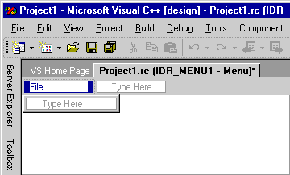

# Menu Editor (C++)

Menus allow you to arrange commands in a logical and easy-to-find fashion. With the **Menu Editor**, you can create and edit menus by working directly with a menu bar that closely resembles the one in your finished application.

> [!TIP]
> While using the **Menu Editor**, in many instances, you can right-click to display a pop-up menu of frequently used commands. The commands available depend on what the pointer is pointing to.

## How To

The **Menu Editor** enables you:

### To create a standard menu

1. Go to menu **View** > **Other Windows** > **Resource View** and right-click on the **Menu** heading. Choose **Add Resource**, then **Menu**.

1. Select the **New Item** box (the rectangle that contains *Type Here*) on the menu bar.

   <br/>
   **New Item** box

1. Type a name for your new menu, for example, *File*.

   The text you type appears in both the **Menu Editor** and in the **Caption** box in the [Properties Window](/visualstudio/ide/reference/properties-window). You can edit the properties for your new menu in either location.

   Once you have given your new menu a name on the menu bar, the new-item box shifts to the right (to allow you to add another menu), and another new-item box opens below your first menu so you can add menu commands to it.

   <br/>
   **New Item** box with focus shifted after you type menu name

   > [!NOTE]
   > To create a single-item menu on the menu bar, set the **Popup** property to **False**.

### To create a submenu

1. Select the menu command for which you want to create a submenu.

1. In the **New Item** box that appears to the right, type the name of the new menu command. This new command will appear first on the submenu menu.

1. Add additional menu commands to the submenu menu.

### To insert a new menu between existing menus

Select an existing menu name and press the **Insert** key, or right-click on the menu bar and choose **Insert New**.

   The **New Item** box is inserted before the selected item.

### To add commands to a menu

1. Create a menu. Then select a menu name, for example, **File**.

   Each menu will expand and expose a new item box for commands. For example, you can add the commands **New**, **Open**, and **Close** to a **File** menu.

1. In the new item box, type a name for the new menu command.

   > [!NOTE]
   > The text you type appears in both the **Menu Editor** and in the **Caption** box in the [Properties Window](/visualstudio/ide/reference/properties-window). You can edit the properties for your new menu in either location.

   > [!TIP]
   > You can define a mnemonic key (hot key) that allows the user to select the menu command. Type an ampersand (`&`) in front of a letter to specify it as the mnemonic. The user can select the menu command by typing that letter.

1. In the **Properties** window, select the menu command properties that apply. For details, see [Menu Command Properties](../windows/menu-command-properties.md).

1. In the **Prompt** box in the **Properties** window, type the prompt string you want to appear in your application's status bar.

   This step creates an entry in the string table with the same resource identifier as the menu command you created.

   > [!NOTE]
   > Prompts can only apply to menu items with a **Popup** property of **True**. For example, top-level menu items can have prompts if they have sub-menu items. The purpose of a **Prompt** is to indicate what will happen if a user selects the menu item.

1. Press **Enter** to complete the menu command.

   The new item box is selected so you can create additional menu commands.

### To select multiple menu commands to run bulk operations such as deleting or changing properties

While holding down the **Ctrl** key, select the menus or submenu commands you want.

### To move and copy menus and menu commands

- Use the drag-and-drop method:

   1. Drag or copy the item you want to move to:

      - A new location on the current menu.

      - A different menu. You can navigate to other menus by dragging the mouse pointer over them.

   1. Drop the menu command when the insertion guide shows the position you want.

- Use shortcut menu commands:

   1. Right-click one or more menus or menu commands, then choose **Cut** (to move) or **Copy**.

   1. If you're moving the items to another menu resource or resource script file, [open it in another window](/visualstudio/ide/customizing-window-layouts-in-visual-studio).

   1. Select the position of the menu or menu command you want to move or copy to.

   1. From the shortcut menu, choose **Paste**. The moved or copied item is placed before the item you select.

> [!NOTE]
> You can also drag, copy, and paste to other menus in other menu windows.

### To delete a menu or menu command

Right-click the menu name or command and choose **Delete**.

> [!NOTE]
> Similarly, you can use the shortcut menu to perform other actions such as Copy, Cut, Paste, Insert New, Insert Separator, Edit IDs, View as Pop-up, Check Mnemonics, etc.

## Pop-up Menus

[Pop-up menus](../mfc/menus-mfc.md) display frequently used commands. They can be context sensitive to the location of the pointer. Using pop-up menus in your application requires building the menu itself and then connecting it to application code.

Once you've created the menu resource, your application code needs to load the menu resource and use [TrackPopupMenu](/windows/win32/api/winuser/nf-winuser-trackpopupmenu) to cause the menu to appear. Once the user has dismissed the pop-up menu by selecting outside it, or has selected a command, that function will return. If the user chooses a command, that command message will be sent to the window whose handle was passed.

> [!NOTE]
> For Microsoft Foundation Class (MFC) library programs and ATL programs, use **Code Wizards** to hook menu commands to code. For more information, see [Adding an Event](../ide/adding-an-event-visual-cpp.md) and [Mapping Messages to Functions](../mfc/reference/mapping-messages-to-functions.md).

- To create a pop-up menu, create a menu with an empty title and don't provide a *Caption*. Then, add a menu command to the new menu, move to the first menu command below the blank menu title with the temporary caption *Type Here* and type a *Caption* and any other information.

   Repeat this process for any other menu commands in the pop-up menu and be sure to save the menu resource.

- To connect a pop-up menu to your application, for example, add a message handler for WM_CONTEXTMENU, then add the following code to the message handler:

    ```cpp
    CMenu menu;
    VERIFY(menu.LoadMenu(IDR_MENU1));
    CMenu* pPopup = menu.GetSubMenu(0);
    ASSERT(pPopup != NULL);
    pPopup->TrackPopupMenu(TPM_LEFTALIGN | TPM_RIGHTBUTTON, point.x, point.y, AfxGetMainWnd());
    ```

   > [!NOTE]
   > The [CPoint](../atl-mfc-shared/reference/cpoint-class.md) passed by the message handler is in screen coordinates.

Normally, when you're working in the **Menu Editor**, a menu resource is displayed as a menu bar. However, you might have menu resources that are added to the application's menu bar while the program is running.

- To view a menu resource as a pop-up menu, right-click the menu and choose **View as Popup**.

   This option is only a viewing preference and won't modify your menu.

> [!TIP]
> To change back to the menu-bar view, select **View as Popup** again. This action removes the check mark and returns your menu-bar view.

## Requirements

Win32

## See also

[Resource Editors](../windows/resource-editors.md)<br/>
[Menu Commands](../windows/menu-command-properties.md)<br/>
[User-Interface Objects and Command IDs](../mfc/user-interface-objects-and-command-ids.md)<br/>
[Menus](../mfc/menus-mfc.md)<br/>
[Menus](/windows/win32/menurc/menus)
