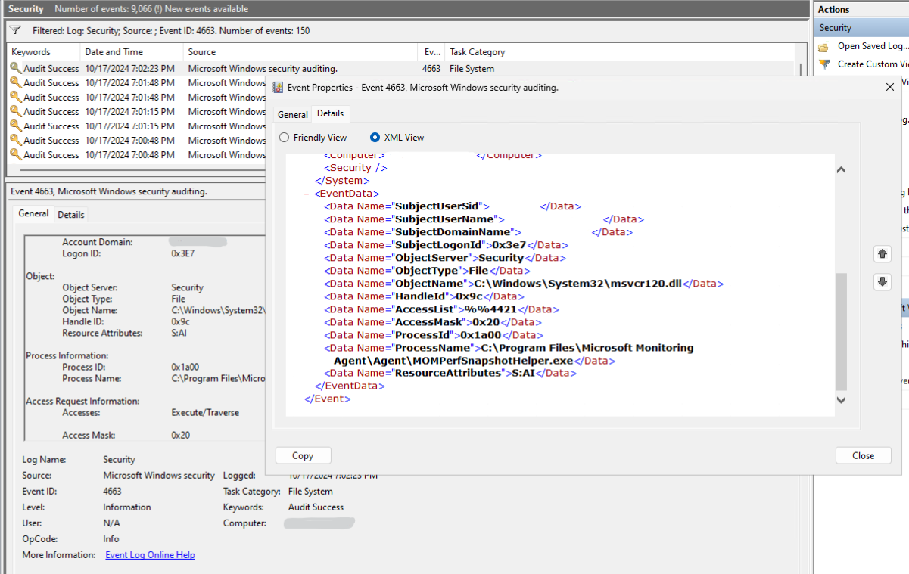

# How To Audit Visual C++ Runtime Version Usage Within Your Organization

The Microsoft Visual C++ Redistributable and the Visual C++ Studio Runtime (collectively, "VC Runtime") is a critical component to thousands of applications. Across your enterprise network, machines may still be running applications that install and use an out-of-support version of the VC Runtime. NTFS File Auditing can be used to identify such usage as a step towards helping you replace these applications with ones that take a dependency on a supported version of the VC Runtime. This guide will walk you through setting up NTFS File Auditing, provide troubleshooting tips, and highlight the benefits of regular audits.

For details on the versions of VC Runtime no longer supported, see [Microsoft Visual C++ Redistributable latest supported downloads](https://learn.microsoft.com/en-us/cpp/windows/latest-supported-vc-redist).

## Enabling NTFS File Auditing to determine usage of VC Runtime

NTFS File Auditing can be used to determine which process is calling VC Runtime files. You can use this information on machines with legacy versions of the VC Runtime already installed to determine which applications are calling the unsupported versions of the VC Runtime.

This guide will first provide steps to manually enable NTFS File Auditing and review logs. Because there are several component files that can be used by an application, this guide also provides and recommends that you use PowerShell's [Get-Acl](https://learn.microsoft.com/en-us/powershell/module/microsoft.powershell.security/get-acl?view=powershell-5.1) and [Set-Acl](https://learn.microsoft.com/en-us/powershell/module/microsoft.powershell.security/set-acl?view=powershell-5.1) cmdlets to update Auditing permissions. For details on how to configure the audit policies on a file, see [Apply a basic audit policy on a file or folder.](https://learn.microsoft.com/en-us/previous-versions/windows/it-pro/windows-10/security/threat-protection/auditing/apply-a-basic-audit-policy-on-a-file-or-folder)

### Manually enable object access auditing on the system

Object access must be enabled before you enable file level auditing.

1. Open the Group Policy Editor (with gpedit.msc).
2. Navigate to Computer Configuration > Windows Settings > Security Settings > Advanced Audit Policy Configuration > System Audit Policies > Object Access.
3. Double-click on Audit File System. In the Audit File System Properties dialog, select Configure the following audit events, select Success and then select OK.
4. Close the policy editor app

Alternatively, you may use auditpol.exe to enable object access.

1. List the current settings with AuditPol.exe /get /category:"Object Access".
2. Enable/Disable with AuditPol.exe /set /category:"Object Access" /subcategory:"File System" /success:enable.

### Manually enable auditing on a file

To monitor which process is accessing a VC Runtime file, enable auditing on the file.

1. Right-click on the file that you want to audit, select Properties, and then select Security tab.

    * See the section below [VC Runtime installed locations](#vcruntime_install_location) to find the VC Runtime files installed on a machine.

2. Select Advanced.

3. In the Advanced Security Settings dialog box, select Auditing tab and then select Continue.

4. To add a new auditing rule, select Add. In the Auditing Entry dialog, select a principal, then type the name of the user or group you want to add (Everyone) and then select OK.

5. In the Type box, use the default of Success.

6. Select Show advance permissions, select Clear all and then select Traverse folder / execute file, and select OK.

7. At this point there should be a new row in the Auditing entries: matching what you have selected. Select OK.

8. In the Properties Dialog, select OK.

The audit rule is enabled now.

### Manually review audit logs

NTFS File Auditing will generate [_Event 4663: An attempt was made to access an object_](https://learn.microsoft.com/previous-versions/windows/it-pro/windows-10/security/threat-protection/auditing/event-4663) for each file that includes + audit permission and the+ process accessing process namethe file.

1. Open Event Viewer: Press Windows + R, type eventvwr.msc, and press Enter.

2. Navigate to Security Logs: In the Event Viewer, expand Windows Logs and select Security. The results pane lists individual security events.

3. Filter and Analyze the Logs: Use the Filter Current Log option to narrow down the events to Event ID 4663 (Audit Success for the File System Category).

For an example of a File Access Auditing Event 4663, see [4663(S): An attempt was made to access an object.](https://learn.microsoft.com/en-us/previous-versions/windows/it-pro/windows-10/security/threat-protection/auditing/event-4663)



### Using PowerShell to enable auditing of VC Runtime usage

The general workflow for updating the File Auditing Permissions with PowerShell is as follows:

1. Define the [file system audit rule](https://learn.microsoft.com/en-us/dotnet/api/system.security.accesscontrol.filesystemauditrule.-ctor) to be applied to the file(s).

2. Obtain a file's security descriptor with [Get-Acl](https://learn.microsoft.com/en-us/powershell/module/microsoft.powershell.security/get-acl?view=powershell-5.1).

3. [Apply the audit rule](https://learn.microsoft.com/en-us/dotnet/api/system.security.accesscontrol.filesystemsecurity.setaccessrule) to the security descriptor.

4. Apply the updated security descriptor on the original file with [Set-Acl](https://learn.microsoft.com/en-us/powershell/module/microsoft.powershell.security/set-acl?view=powershell-5.1).

5. View File Access Auditing Event 4663 records with [Get-WinEvent](https://learn.microsoft.com/en-us/powershell/module/microsoft.powershell.diagnostics/get-winevent?view=powershell-5.1).

### PowerShell: Enable auditing on out-of-support VC Runtime files

The following PowerShell section of code will enable usage auditing of the currently installed out-of-support VC Runtime files.

```sh
function Get-AuditRuleForFile { 
    $auditRuleArguments =   'Everyone'              <# identity #>, 
                            'ExecuteFile, Traverse' <# fileSystemRights #>, 
                            'Success'               <# flags #> 
    $auditRule = New-Object System.Security.AccessControl.FileSystemAuditRule($auditRuleArguments) 

    return $auditRule 
} 

function Set-FileAuditRule { 
    param ( 
        [Parameter(Mandatory = $true)] 
        [ValidateNotNullOrEmpty()] 
        [string]$file, 
        [Parameter(Mandatory = $true)] 
        [ValidateNotNullOrEmpty()] 
        [System.Security.AccessControl.FileSystemAuditRule]$auditRule 
    ) 

    $existingAcl = Get-Acl -Path $file 
    $existingAcl.AddAuditRule($auditRule) | Out-Null 
    Set-Acl -Path $file -AclObject $existingAcl 
} 

$newAuditRule = Get-AuditRuleForFile 

# Visual Studio Redistributable for 2005 (VC++ 8.0) and 2008 (VC++ 9.0) 
Get-ChildItem "$ENV:SystemRoot\WinSxS\Fusion" -filter '*.dll' -ErrorAction SilentlyContinue -Recurse | 
Where-Object FullName -IMatch 'microsoft\.vc[89]0' | 
ForEach-Object { 
    Set-FileAuditRule $_.FullName $newAuditRule 
} 

# Visual Studio Redistributable for 2010 (VC++ 10.0), 2012 (VC++ 11.0) and 2013 (VC++ 12.0)  
$languageCodes = 'chs|cht|deu|enu|esn|fra|ita|jpn|kor|rus' 
$versions = '(1[012]0)' 
$regex = "^((atl|msvc[pr]|vcamp|vccorlib|vcomp)$versions|mfc$versions(u|$languageCodes)?|mfcm$versions(u)?)\.dll$" 
Get-ChildItem "$ENV:SystemRoot\SysWOW64","$ENV:SystemRoot\System32" -filter '*.dll' |  
Where-Object Name -imatch $regex |  
ForEach-Object {  
    Set-FileAuditRule $_.FullName $newAuditRule  
}
```

### PowerShell: Viewing file auditing events

PowerShell provides Get-WinEvent to obtain event records for various event logs.

The following PowerShell section of code will list all of the Auditing Event 4663 records over the past 24 hours.

```sh
function Get-AuditEntries {  
    param (  
        [Parameter(Mandatory = $true)]  
        [ValidateNotNullOrEmpty()]  
        [System.DateTime]$oldestTime  
    )  
    Get-WinEvent -FilterHashtable @{LogName='Security';Id=4663;StartTime=(Get-Date $oldestTime)} |  
    ForEach-Object {  
        $record = [ordered]@{}  
        $record['TimeCreated'] = $_.TimeCreated  
        $accessName = ($_.Message |  
            Select-String -Pattern "Accesses:[\t\s]+(?<Accesses>.+)").Matches.Groups[1]  
        ([xml]$_.ToXML()).Event.EventData.ChildNodes |  
        ForEach-Object -Begin {  
            $record[$accessName.Name]=$accessName.Value.Trim()  
        } -Process {  
            $record[$_.Name] = $_.'#text'  
        }  
        [PSCustomObject]$record  
    } | 
    Where-Object { $_.ObjectName -imatch '\.dll$'}  
}

Get-AuditEntries -oldestTime (Get-Date).AddHours(-24) 
```

Example output from the above block of code is as follows:

```
TimeCreated : 11/20/2024 5:00:11 AM
Accesses : Execute/Traverse
SubjectUserSid : \*\*\*\*\*
SubjectUserName : \*\*\*\*\*
SubjectDomainName : WORKGROUP
SubjectLogonId : \*\*\*\*\*
ObjectServer : Security
ObjectType : File
ObjectName : C:\\Windows\\WinSxS\\amd64\_microsoft.vc90.crt\_1fc8b3b9a1e18e3b\_9.0.30729.9635\_none\_08e2c157a83ed5da\\msvcr90.dll
HandleId : 0x93c
AccessList : %%4421
AccessMask : 0x20
ProcessId : 0x24d4
ProcessName : C:\\Windows\\System32\\WindowsPowerShell\\v1.0\\powershell.exe
ResourceAttributes : S:AI
```

### Next Steps After Auditing VC Runtime Usage

After you have determined which processes are using the VC Runtime files or installing the VC Redistributable, uninstall those applications or upgrade them to newer versions that do not depend on unsupported VC Runtimes.

Note that some Microsoft applications do require legacy versions of the VC Runtime. For details, see [Visual C++ Redistributable and runtime libraries FAQ | Microsoft Learn](https://learn.microsoft.com/lifecycle/faq/visual-c-faq).

<a id="vcruntime_install_location"></a>

## VC Runtime installed locations

The following section lists where each version of the VC Runtime component files are installed.

| **Visual Studio Version**| **Installed Location(s)**|
| ------------- | ------------- |
| Visual Studio 2013 (VC++ 12.0) | `%SystemRoot%\\System32, %SystemRoot%\\SysWOW64` |
| Visual Studio 2012 (VC++ 11.0) | `%SystemRoot%\\System32, %SystemRoot%\\SysWOW64` |
| Visual Studio 2010 (VC++ 10.0) | `%SystemRoot%\\System32, %SystemRoot%\\SysWOW64` |
| Visual Studio 2008 (VC++ 9.0) | `%SystemRoot%\\WinSxS\\Fusion` |
| Visual Studio 2005 (VC++ 8.0) | `%SystemRoot%\\WinSxS\\Fusion` |

## See also

* [Redistributing Visual C++ Files](redistributing-visual-cpp-files.md)
* [The latest supported Visual C++ downloads](latest-supported-vc-redist.md)
* [Lifecycle FAQ - Visual C++ Redistributable and runtime libraries](https://learn.microsoft.com/en-us/lifecycle/faq/visual-c-faq)
