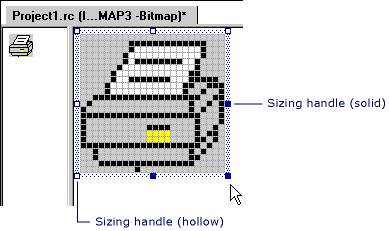

# How to: Edit an Image

You can use selection tools to define an area of an image that you want to cut, copy, clear, resize, invert, or move. With the **Rectangle Selection** tool you can define and select a rectangular region of the image. With the **Irregular Selection** tool you can draw a freehand outline of the area you want to select for the cut, copy, or other operation.

> [!NOTE]
> See the **Rectangle Selection** and **Irregular Selection** tools pictured in [Image Editor toolbar](./image-editor-for-icons.md) or view the tool tips associated with each button on the **Image Editor** toolbar.

You can also create a custom brush from a selection. For more information, see [Creating a Custom Brush](./using-a-drawing-tool-image-editor-for-icons.md).

## How To

To edit an image, see how:

### To select an image

1. Use the **Image Editor** toolbar or go to menu **Image** > **Tools** and choose the selection tool you want.

1. Move the insertion point to one corner of the image area that you want to select. Cross hairs appear when the insertion point is over the image.

1. Drag the insertion point to the opposite corner of the area you want to select. A rectangle shows which pixels will be selected. All pixels within the rectangle, including those under the rectangle, are included in the selection.

1. Release the mouse button. The selection border encloses the selected area.

#### To select an entire image

Select the image outside of the current selection. The selection border changes focus and encompasses the whole image once again.

### To edit parts of an image

You can perform standard editing operations — cutting, copying, clearing, and moving — on a [selection](../windows/selecting-an-area-of-an-image-image-editor-for-icons.md), whether the selection is the entire image or just a part of it. Because the **Image Editor** uses the **Windows Clipboard**, you can transfer images between the **Image Editor** and other applications for Windows.

In addition, you can resize the selection, whether it includes the entire image or just a part.

#### To cut the current selection and move it to the clipboard

Go to menu **Edit** > **Cut**.

#### To copy the selection

1. Position the pointer inside the selection border or anywhere on it except the sizing handles.

1. Hold down the **Ctrl** key as you drag the selection to a new location. The area of the original selection is unchanged.

1. To copy the selection into the image at its current location, select outside the selection cursor.

#### To paste the clipboard contents into an image

1. Go to menu **Edit** > **Paste**.

   The clipboard contents, surrounded by the selection border, appear in the upper-left corner of the pane.

1. Position the pointer within the selection border and drag the image to the desired location on the image.

1. To anchor the image at its new location, select outside of the selection border.

#### To delete the current selection without moving it to the clipboard

Go to menu **Edit** > **Delete**.

   The original area of the selection is filled with the current background color.

> [!NOTE]
> You can access the **Cut**, **Copy**, **Paste**, and **Delete** commands by right-clicking in the **Resource View** window.

#### To move the selection

1. Position the pointer inside the selection border or anywhere on it except the sizing handles.

1. Drag the selection to its new location.

1. To anchor the selection in the image at its new location, select outside the selection border.

For more information on drawing with a selection, see [Creating a Custom Brush](./using-a-drawing-tool-image-editor-for-icons.md).

### To flip an image

You can flip or rotate an image to either create a mirror image of the original, turn the image upside down, or rotate the image to the right 90 degrees at a time.

- To flip the image horizontally (mirror image), go to menu **Image** > **Flip Horizontal**.

- To flip the image vertically (turn upside down), go to menu **Image** > **Flip Vertical**.

- To rotate the image 90 degrees, go to menu **Image** > **Rotate 90 Degrees**.

   > [!NOTE]
   > You can also use the [accelerator (shortcut) keys](../windows/accelerator-keys-image-editor-for-icons.md) for these commands or access the commands from the shortcut menu (select outside the image while in the **Image Editor**).

### To resize an image

The behavior of the **Image Editor** while resizing an image depends on whether you've [selected](../windows/selecting-an-area-of-an-image-image-editor-for-icons.md) the entire image or just part of it.

When the selection includes only part of the image, the **Image Editor** shrinks the selection by deleting rows or columns of pixels and filling the vacated regions with the current background color. It can also stretch the selection by duplicating rows or columns of pixels.

When the selection includes the entire image, the **Image Editor** either shrinks and stretches the image, or crops and extends it.

There are two mechanisms for resizing an image: the sizing handles and the [Properties window](/visualstudio/ide/reference/properties-window). You drag the sizing handles to change the size of all or part of an image. Sizing handles that you can drag are solid. You can't drag handles that are hollow. Use the **Properties** window to resize the entire image only, not a selected part.

 
Sizing handles

> [!NOTE]
> If you have the **Tile Grid** option selected in the [Grid Settings dialog box](./image-editor-for-icons.md), then resizing snaps to the next tile grid line. If only the **Pixel Grid** option is selected (the default setting), resizing snaps to the next available pixel.

#### To resize an entire image using the properties window

1. Open the image whose properties you want to change.

1. In the **Width** and **Height** boxes in the [Properties window](/visualstudio/ide/reference/properties-window), type the dimensions that you want.

   If you're increasing the size of the image, the **Image Editor** extends the image to the right, downward, or both, and fills the new region with the current background color. The image isn't stretched.

   If you shorten the size of the image, the **Image Editor** crops the image on the right or bottom edge, or both.

   > [!NOTE]
   > You can use the **Width** and **Height** properties to resize only the entire image, not to resize a partial selection.

#### To crop or extend an entire image

1. Select the entire image.

   If part of the image is currently selected, and you want to select the entire image, select anywhere on the image outside the current selection border.

1. Drag a sizing handle until the image is the right size.

Normally, the **Image Editor** crops or enlarges an image when you resize it by moving a sizing handle. If you hold down the **Shift** key as you move a sizing handle, the **Image Editor** shrinks or stretches the image.

#### To shrink or stretch an entire image

1. Select the entire image.

   If a part of the image is currently selected and you want to select the entire image, select anywhere on the image outside the current selection border.

1. Hold down the **Shift** key and drag a sizing handle until the image is the right size.

#### To shrink or stretch part of an image

1. Select the part of the image you want to resize. For more information, see [Selecting an Area of the Image](../windows/selecting-an-area-of-an-image-image-editor-for-icons.md).

1. Drag one of the sizing handles until the selection is the right size.

### To edit an image outside of a project

You can open and edit images in the development environment just as you would in any graphics application, for example opening a bitmap for stand-alone editing. The images you work with need not be part of a Visual Studio project.

1. Go to menu **File** > **Open**.

1. In the **Files of Type** box, select **All Files**.

1. Locate and open the image you want to edit.

### To change image properties

You can set or modify properties of an image using the [Properties window](/visualstudio/ide/reference/properties-window).

1. Open the image in the **Image Editor**.

1. In the **Properties** window, change any or all properties for your image.

   |Property|Description|
   |--------------|-----------------|
   |**Colors**|Specifies the color scheme for the image. Select **Monochrome**, **16**, or **256**, or **True Color**.  If you've already drawn the image with a 16-color palette, selecting **Monochrome** causes substitutions of black and white for the colors in the image. Contrast is not always maintained: for example, adjacent areas of red and green are both converted to black.|
   |**Filename**|Specifies the name of the image file.  By default, Visual Studio assigns a base filename created by removing the first four characters ("IDB_") from the default resource identifier (IDB_BITMAP1) and adding the appropriate extension. The file name for the image in this example would be *BITMAP1.bmp*. You could rename it *MYBITMAP1.bmp*.|
   |**Height**|Sets the height of the image (in pixels). The default value is 48.  The image is cropped or blank space is added below the existing image.|
   |**ID**|Sets the resource's identifier.  For an image, Microsoft Visual Studio, by default, assigns the next available identifier in a series: IDB_BITMAP1, IDB_BITMAP2, and so forth. Similar names are used for icons and cursors.|
   |**Palette**|Changes color properties.  Double-click to select a color and display the [Custom Color Selector dialog box](./image-editor-for-icons.md). Define the color by typing RGB or HSL values in the appropriate text boxes.|
   |**SaveCompressed**|Indicates whether the image is in a compressed format. This property is read-only.  Visual Studio doesn't allow you to save images in a compressed format, so for any images created in Visual Studio, this property will be **False**. If you open a compressed image (created in another program) in Visual Studio, this property will be **True**. If you save a compressed image using Visual Studio, it will be uncompressed and this property will revert back to **False**.|
   |**Width**|Sets the width of the image (in pixels). The default value for bitmaps is 48.  The image is cropped or blank space is added to the right of the existing image.|

## Requirements

None

## See also

[Image Editor for Icons](../windows/image-editor-for-icons.md) 
[How to: Create an Icon or Other Image](../windows/creating-an-icon-or-other-image-image-editor-for-icons.md) 
[How to: Use a Drawing Tool](../windows/using-a-drawing-tool-image-editor-for-icons.md) 
[How to: Work with Color](../windows/working-with-color-image-editor-for-icons.md) 
[Accelerator Keys](../windows/accelerator-keys-image-editor-for-icons.md) 
