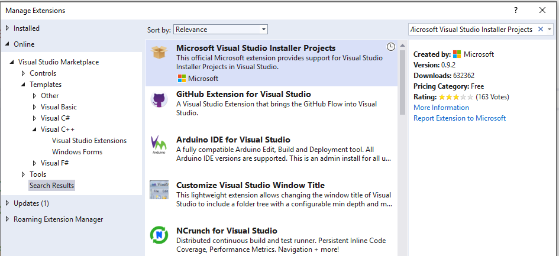

# Walkthrough: Deploying a Visual C++ Application By Using a Setup Project

Describes how to use a setup project to deploy a Visual C++ application.

## Prerequisites

You need the following components to complete this walkthrough:

- A computer with Visual Studio installed.

- An additional computer that doesn't have the Visual C++ libraries.

## Create the setup project

Instructions for creating a setup project vary depending on which version of Visual Studio you have installed. To see the documentation for your preferred version of Visual Studio, use the **Version** selector control. It's found at the top of the table of contents on this page.

::: moniker range="=msvc-160"

### To create the project in Visual Studio 2019

1. On the menu bar, choose **File** > **New** > **Project** to open the **Create a New Project** dialog box.

   

1. At the top of the dialog, type `MFC` in the search box and then choose **MFC App** from the results list. If you do not see it, you will need to launch the Visual Studio Installer program from the Windows Start menu and click on the **C++ Desktop Development workload** tile. Under **Individual Components**, ensure that the MFC component is checked.

1. In the next page, enter a name for the project, and specify the project location if desired.

1. Choose the **Create** button to create the client project. When the **MFC Application Wizard** appears, accept all the defaults.

1. Change the active solution configuration to **Release**. From the **Build** menu, select **Configuration Manger**. From the **Configuration Manager** dialog box, select **Release** from the **Active solution configuration** drop-down box. Click **Close**.

1. Press **Ctrl**+**Shift**+**B** to build the application. Or, on the **Build** menu, click **Build Solution**. Building the application enables the setup project to use the output of this MFC application project.

1. If you haven't already done so, download the Microsoft Visual Studio Installer Projects extension. The extension is free for Visual Studio developers and adds the functionality of the setup and deployment project templates to Visual Studio. When you're connected to the Internet, in Visual Studio, choose **Extensions** > **Manage Extensions**. Under the **Extensions and Updates** dialog, select the **Online** tab and type *Microsoft Visual Studio Installer Projects* in the search box. Press **Enter**, select **Microsoft Visual Studio \<version> Installer Projects**, and click **Download**. Choose to run and install the extension, then restart Visual Studio.

   

1. On the Visual Studio menu bar, choose **File** > **Recent Projects and Solutions**, and then choose to reopen your project.

1. On the menu bar, choose **File** > **New** > **Project** to open the **Create a New Project** dialog box. In the search box, type "Setup" and from the results list choose **Setup Project**.

1. Enter a name for the setup project in the **Name** box. In the **Solution** drop-down list, select **Add to solution**. Choose the **OK** button to create the setup project. A **File Assistant (ProjectName)** tab opens in the editor window.

::: moniker-end

::: moniker range="=msvc-150"

### To create the project in Visual Studio 2017

1. Create a new project. On the **File** menu, point to **New**, and then click **Project**.

1. Use the **MFC Application Wizard** to create a new Visual Studio solution. To find the wizard, from the **New Project** dialog box, expand the **Visual C++** node, select **MFC**, select **MFC Application**, enter a name for the project, and then click **OK**. Click **Finish**.

   > [!NOTE]
   > If the **MFC Application** type is missing, select **Open Visual Studio Installer** in the left pane of the **New Project** dialog box. Install the option located under **Desktop development with C++** in the **Optional** components section, named **Visual C++ MFC for x86 and x64**.

1. Change the active solution configuration to **Release**. From the **Build** menu, select **Configuration Manger**. From the **Configuration Manager** dialog box, select **Release** from the **Active solution configuration** drop-down box. Click **Close**.

1. Press **Ctrl**+**Shift**+**B** to build the application. Or, on the **Build** menu, click **Build Solution**. Building the application enables the setup project to use the output of this MFC application project.

1. If you haven't already done so, download the Microsoft Visual Studio Installer Projects extension. The extension is free for Visual Studio developers and adds the functionality of the setup and deployment project templates to Visual Studio. When you're connected to the Internet, in Visual Studio, choose **Tools** > **Extensions and Updates**. Under the **Extensions and Updates** dialog, select the **Online** tab and type *Microsoft Visual Studio Installer Projects* in the search box. Press **Enter**, select **Microsoft Visual Studio \<version> Installer Projects**, and click **Download**. Choose to run and install the extension, then restart Visual Studio.

1. On the menu bar, choose **File** > **Recent Projects and Solutions**, and then choose to reopen your project.

1. On the menu bar, choose **File** > **New** > **Project** to open the **New Project** dialog box. Then in the left pane of the dialog box, expand the **Installed** > **Other Project Types** nodes, and select **Visual Studio Installer**. In the center pane, select **Setup Project**.

1. Enter a name for the setup project in the **Name** box. In the **Solution** drop-down list, select **Add to solution**. Choose the **OK** button to create the setup project. A **File Assistant (ProjectName)** tab opens in the editor window.

::: moniker-end

::: moniker range="=msvc-140"

### To create the project in Visual Studio 2015

1. Create a new project. On the **File** menu, point to **New**, and then click **Project**.

1. Use the **MFC Application Wizard** to create a new Visual Studio solution. To find the wizard, from the **New Project** dialog box, expand the **Visual C++** node, select **MFC**, select **MFC Application**, enter a name for the project, and then click **OK**. Click **Finish**.

   > [!NOTE]
   > If the **MFC Application** type is missing, click on the Windows Start button and type **Add Remove Programs**. Open the program from the results list and then find your Microsoft Visual Studio 2015 installation in the list of installed programs. Double-click it, then choose **Modify** and select the **Microsoft Foundation Classes** component under **Visual C++**.

1. Change the active solution configuration to **Release**. From the **Build** menu, select **Configuration Manager**. From the **Configuration Manager** dialog box, select **Release** from the **Active solution configuration** drop-down box. Click **Close**.

1. Press **Ctrl**+**Shift**+**B** to build the application. Or, on the **Build** menu, click **Build Solution**. Building the application enables the setup project to use the output of this MFC application project.

1. If you haven't already done so, download the Microsoft Visual Studio Installer Projects extension. The extension is free for Visual Studio developers and adds the functionality of the setup and deployment project templates to Visual Studio. When you're connected to the Internet, in Visual Studio, choose **Tools** > **Extensions and Updates**. Under the **Extensions and Updates** dialog, select the **Online** tab and type *Microsoft Visual Studio Installer Projects* in the search box. Press **Enter**, select **Microsoft Visual Studio \<version> Installer Projects**, and click **Download**. Choose to run and install the extension, then restart Visual Studio.

1. On the menu bar, choose **File** > **Recent Projects and Solutions**, and then choose to reopen your project.

1. On the menu bar, choose **File** > **New** > **Project** to open the **New Project** dialog box. Then in the left pane of the dialog box, expand the **Installed** > **Other Project Types** nodes, and select **Visual Studio Installer**. In the center pane, select **Setup Project**.

1. Enter a name for the setup project in the **Name** box. In the **Solution** drop-down list, select **Add to solution**. Choose the **OK** button to create the setup project. A **File Assistant (ProjectName)** tab opens in the editor window.

::: moniker-end

## Add items to the project

1. Right-click the **Application Folder** node and select **Add** > **Project Output** to open the **Add Project Output Group** dialog box. In the dialog box, select **Primary Output** and click **OK**. A new item named **Primary Output from ProjectName (Active)** appears.

1. Right-click the **Application Folder** node and select **Add** > **Assembly** to open the **Select Component** dialog box. Select and add any required DLLs needed by the program, as described by the article [Determining Which DLLs to Redistribute](determining-which-dlls-to-redistribute.md).

1. Select the item **Primary Output from ProjectName (Active)**, right-click and choose **Create Shortcut to Primary Output from ProjectName (Active)**. A new item named **Shortcut to Primary Output from ProjectName (Active)** appears. You may rename the shortcut item, then drag and drop the item into the **User's Programs Menu** node on the left side of the window.

1. On the menu bar, choose **Build** > **Configuration Manager**. In the **Project** table, under the **Build** column, check the box for the deployment project. Click **Close**.

1. On the menu bar, choose **Build** > **Build Solution** to build the MFC project and the deployment project.

1. In the solution folder, locate the setup.exe program that was built from the deployment project. You can copy this file (and the .msi file) to install the application and its required library files on another computer. Run the setup program on a second computer that doesn't have the Visual C++ libraries.

## See also

[Deployment Examples](deployment-examples.md) 
