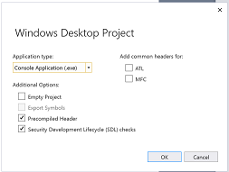

# Windows Desktop Wizard

The Windows Desktop Wizard replaces the Win32 Application Wizard in Visual Studio 2017 and later. The wizard allows you to create any of four types of C++ projects (listed in the heading in the table below). In each case, you can specify additional options that are appropriate for the type of project you open.

   

The following table indicates which options are available for each application type.

|Type of support|Console application|Executable (Windows) application|Dynamic-link library|Static library|
|---------------------|-------------------------|----------------------------------------|---------------------------|--------------------|
|**Empty project**|Yes|Yes|Yes|No|
|**Export symbols**|No|No|Yes|No|
|**Precompiled header**|No|No|No|Yes|
|**ATL support**|Yes|No|No|No|
|**MFC support**|Yes|No|No|Yes|

## Overview

This wizard page describes the current project settings for the Win32 application you are creating. By default, the following options are set:

- The project is a Windows application.

- The project is not empty.

- The project contains no export symbols.

- The project does not use a precompiled header file (this option is available for static library projects only).

- The project includes support for neither MFC nor ATL.

## Application type

Creates the specified application type.

|Option|Description|
|------------|-----------------|
|**Console application**|Creates a console application. The Visual C++ [run-time libraries](../c-runtime-library/c-run-time-library-reference.md) also provide output and input from console windows with standard I/O functions, such as `printf_s()` and `scanf_s()`. A console application has no graphical user interface. It compiles into an .exe file and can be run as a stand-alone application from the command line.   You can add MFC and ATL support to a console application.|
|**Windows application**|Creates a Win32 program. A Win32 program is an executable application (EXE) written in C or C++, using calls to the Win32 API to create a graphical user interface.   You cannot add MFC or ATL support to a Windows application.|
|**Dynamic Link Library**|Creates a Win32 dynamic-link library (DLL). A Win32 DLL is a binary file, written in C or C++, that uses calls to the Win32 API rather than to MFC classes, and that acts as a shared library of functions that can be used simultaneously by multiple applications.   You cannot add MFC or ATL support to a DLL application created by using this wizard, but you can create an MFC DLL by choose **New > Project > MFC DLL**.|
|**Static library**|Creates a static library. A static library is a file containing objects and their functions and data that links into your program when the executable file is built. This topic explains how to create the starter files and [project properties](../build/reference/property-pages-visual-cpp.md) for a static library. A static library file provides the following benefits:  - A Win32 static library is useful if the application you are working on makes calls to the Win32 API rather than to MFC classes. - The linking process is the same whether the rest of your Windows application is written in C or in C++. - You can link a static library to an MFC-based program or to a non-MFC program.|

## Additional options

Defines the support and options for the application, depending on its type.

|Option|Description|
|------------|-----------------|
|**Empty project**|Specifies that the project files are blank. If you have a set of source code files (such as .cpp files, header files, icons, toolbars, dialog boxes, and so on) and want to create a project in the Visual C++ development environment, you must first create a blank project, then add the files to the project.   This selection is unavailable for static library projects.|
|**Export symbols**|Specifies that the DLL project exports symbols.|
|**Precompiled header**|Specifies that the static library project uses a pre-compiled header.|
|**Security Development Lifecycle (SDL) checks**|For more information about SDL, see [Microsoft Security Development Lifecycle (SDL)  Process Guidance](../build/reference/sdl-enable-additional-security-checks.md)|

## Add common headers for:

Add support for one of the libraries supplied in Visual C++.

|Option|Description|
|------------|-----------------|
|**ATL**|Builds into the project support for classes in the Active Template Library (ATL). For Win32 console applications only.   **Note** This option does not indicate support for adding ATL objects using the ATL code wizards. You can add ATL objects only to ATL projects or MFC projects with ATL support.|
|**MFC**|Builds into the project support for the Microsoft Foundation Class (MFC) Library. For Win32 console applications and static libraries only.|

## Remarks

Once you have created a Windows desktop application, you can add generic C++ classes using the [Generic](../ide/adding-a-generic-cpp-class.md#generic-c-class-wizard) Code Wizard. You can add other items, such as HTML files, header files, resources, or text files.

> [!NOTE]
> You cannot add ATL classes, and you can add MFC classes only to those Windows desktop application types that support MFC (see the previous table).

You can view the files the wizard creates for your project in **Solution Explorer**. For more information about the files the wizard creates for your project, see the project-generated file, `ReadMe.txt`. For more information about the file types, [File Types Created for Visual Studio C++ projects](../build/reference/file-types-created-for-visual-cpp-projects.md).

## See also

[C++ project types in Visual Studio](../build/reference/visual-cpp-project-types.md)
