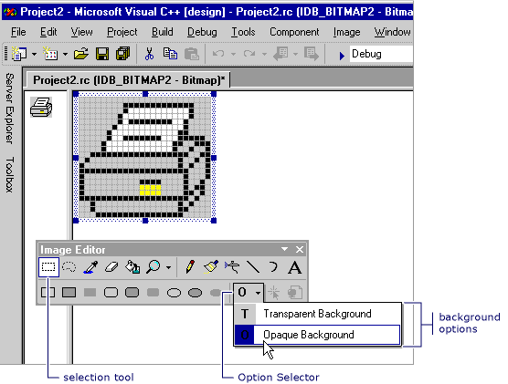

# How to: Work with Color

The **Image Editor** contains many features that specifically handle and customize colors. You can set a foreground or background color, fill bounded areas with color, or select a color on an image to use as the current foreground or background color. You can use tools on the [Image Editor toolbar](./image-editor-for-icons.md) along with the colors palette in the **Colors** window to create images.

All colors for monochrome and 16-color images are shown in the **Colors** palette in the **Colors** window. Along with the 16 standard colors, you can create your own custom colors. Changing any of the colors in the palette will immediately change the corresponding color in the image.

When working with 256-color icon and cursor images, the **Colors** property in the [Properties window](/visualstudio/ide/reference/properties-window) is used. For more information, see [Creating a 256-color icon or cursor](./creating-an-icon-or-other-image-image-editor-for-icons.md).

True-color images can also be created. However, true color samples don't appear in the full palette in the **Colors** window; they appear only in the foreground or background color indicator area. True colors are created using the **Custom Color Selector** dialog box.

You can save customized color palettes on disk and reload them as needed. The color palette you used most recently is saved in the Registry and automatically loaded the next time you start Visual Studio.

The **Colors** window has two parts:

- The **Colors Palette**, which is an array of color samples that represent colors you can use. You can select the samples to choose foreground and background colors when you're using the graphics tools.

- The **Color Indicator**, which shows the foreground and background colors and selectors for screen and inverse color.

    
   **Colors** window

> [!NOTE]
> The **Screen color** and **Inverse color** tools are only available for icons and cursors.

You can use the **Colors** window with the [Image Editor toolbar](./image-editor-for-icons.md).

- To display the **Colors** window, right-click in an **Image Editor** pane and choose **Show Colors Window**, or go to menu [Image](./image-editor-for-icons.md) > **Show Colors Window**.

- To hide the **Colors** window, unpin the window (this action will allow the window to auto hide when it's not in use) or select the **Close** button.

The **Colors** palette initially displays 16 standard colors. With displayed colors, you can also create your own custom colors. You can then save and load a customized Color palette.

The **Custom Color Selector** dialog box allows you to customize the colors you use for your image with the following properties:

|Property|Description|
|--------------------------|--------------------------|
|**Gradient Color Display**|Changes the values of a selected color.  Position the crosshair on the color you want to change and move the slider up or down to change the luminosity or RGB values of the color.|
|**Luminosity Bar**|Sets the luminosity for the color you select in the **Gradient Color Display** box.  Select and drag the white arrow up the bar for greater brightness or down for less. The **Color** box displays the color you've selected and the effect of the luminosity you set.|
|**Color**|Lists the hue (color wheel value) of the color you're defining. Values range from 0 to 240, where 0 is red, 60 is yellow, 120 is green, 180 is cyan, 200 is magenta, and 240 is blue.|
|**Hue**|Lists the hue (color wheel value) of the color you're defining. Values range from 0 to 240, where 0 is red, 60 is yellow, 120 is green, 180 is cyan, 200 is magenta, and 240 is blue.|
|**Sat**|Specifies the saturation value of the color you're defining. Saturation is the amount of color in a specified hue. Values range from 0 to 240.|
|**Lum**|Lists the luminosity (brightness) of the color you're defining. Values range from 0 to 240.|
|**Red**|Specifies the red value of the color you're defining. Values range from 0 to 255.|
|**Green**|Specifies the green value of the color you're defining. Values range from 0 to 255.|
|**Blue**|Specifies the blue value of the color you're defining. Values range from 0 to 255.|

You can save and load a **Colors** palette that contains customized colors. By default, the **Colors** palette most recently used is automatically loaded when you start Visual Studio.

> [!TIP]
> Since the **Image Editor** has no means to restore the default **Colors** palette, you should save the default **Colors** palette under a name such as *standard.pal* or *default.pal* so that you can easily restore the default settings.

Use the **Load Palette Colors** dialog box to load special color palettes to use in your C++ project with following properties:

|Property|Description|
|-----------------|-----------------|
|**Look in**|Specifies the location where you want to locate a file or folder.  Select the arrow to choose another location, or select the folder icon on the toolbar to move up levels.|
|**File name**|Provides a space for you to type the name of the file you want to open.  To quickly find a file you've previously opened, select the file name in the drop-down list, if available.  If you're searching for a file, you can use asterisks (*) as wildcards. For example, you can type \*.\* to see a list of all files. You can also type the full path of a file, for example, *C:\My Documents\MyColorPalette.pal* or *\\\NetworkServer\MyFolder\MyColorPalette.pal*.|
|**Files of type**|Lists the types of files to display.  Palette (*.pal) is the default file type for color palettes.|

## How To

### To select foreground or background colors

Except for the **Eraser**, tools on the **Image Editor** toolbar draw with the current foreground or background color when you press the left or right mouse button, respectively.

- To select a foreground color, with the left mouse button, select the color you want on the **Colors** palette.

- To select a background color, with the right mouse button, select the color you want on the **Colors** palette.

### To fill a bounded area of an image with a color

The **Image Editor** provides the **Fill** tool for filling any enclosed image area with the current drawing color or the current background color.

### To use the fill tool

1. Use the **Image Editor** toolbar or go to menu **Image** > **Tools** and select the **Fill** tool.

1. If necessary, choose drawing colors. In the [Colors palette](./image-editor-for-icons.md), select the left mouse button to select a foreground color or the right mouse button to select a background color.

1. Move the **Fill** tool to the area you want to fill.

1. Select the left or right mouse button to fill with the foreground color or the background color, respectively.

### To pick up a color from an image to use elsewhere

The **Select Color**, or color-pickup, tool makes any color on the image the current foreground color or background color, depending on whether you press the left or the right mouse button. To cancel the **Select Color** tool, choose another tool.

1. Use the **Image Editor** toolbar or go to menu **Image** > **Tools** and select the **Select Color** tool.

1. Select the color you want to pick up from the image.

   > [!NOTE]
   > After you pick up a color, the **Image Editor** reactivates the most recently used tool.

1. Draw using the left mouse button for the foreground color, or the right mouse button for the background color.

### To choose the background

When you move or copy a selection from an image, any pixels in the selection that match the current background color are, by default, transparent and they don't obscure pixels in the target location.

You can switch from a transparent background (the default) to an opaque background, and back again. When you use a selection tool, the **Transparent Background** and **Opaque Background** options appear in the **Option** selector on the **Image Editor** toolbar.

 
**Transparent and Opaque Options** on the **Image Editor Toolbar**

#### To switch between a transparent and opaque background

In the **Image Editor** toolbar, select the **Option** selector, and then choose the appropriate background:

- **Opaque Background (O)**: Existing image is obscured by all parts of the selection.

- **Transparent Background (T)**: Existing image shows through parts of the selection that match the current background color.

> [!TIP]
> For a shortcut, on the **Image** menu, select or clear **Draw Opaque**.

You can change the background color while a selection is already in effect to change which parts of the image are transparent.

### To invert the colors in a selection

The **Image Editor** provides a convenient way to invert colors in the selected part of the image so you can tell how an image would appear with inverted colors.

To invert colors in the current selection, go to menu **Image** > **Invert Colors**.

### To customize or change colors on the colors palette

1. Go to menu **Image** > **Adjust Colors**.

1. In the **Custom Color Selector** dialog box, define the color by typing RGB or HSL values in the appropriate text boxes or choose a color in the **Gradient Color Display** box.

1. Set the luminosity by moving the slider on the **Luminosity** bar.

1. Many custom colors are dithered. If you want the solid color closest to the dithered color, double-click the **Color** box.

   If you later decide you want the dithered color, move the slider on the **Luminosity** bar or move the cross hairs in the **Gradient Color Display** box again to restore the dithering.

1. Select **OK** to add the new color.

### To save a custom colors palette

1. Go to menu **Image** > **Save Palette**.

1. Navigate to the directory where you want to save the palette, and type a name for the palette.

1. Select **Save**.

### To load a custom colors palette

1. Go to menu **Image** > **Load Palette**.

1. In the **Load Color Palette** dialog box, navigate to the correct directory and select the palette you want to load. **Color** palettes are saved with a .pal file extension.

## Requirements

None

## See also

[Image Editor for Icons](../windows/image-editor-for-icons.md) 
[How to: Create an Icon or Other Image](../windows/creating-an-icon-or-other-image-image-editor-for-icons.md) 
[How to: Edit an Image](../windows/selecting-an-area-of-an-image-image-editor-for-icons.md) 
[How to: Use a Drawing Tool](../windows/using-a-drawing-tool-image-editor-for-icons.md) 
[Accelerator Keys](../windows/accelerator-keys-image-editor-for-icons.md) 
